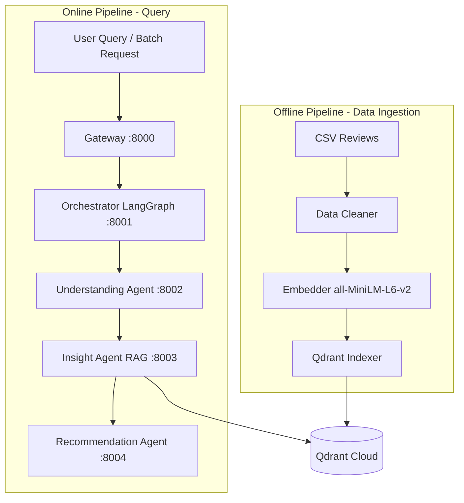
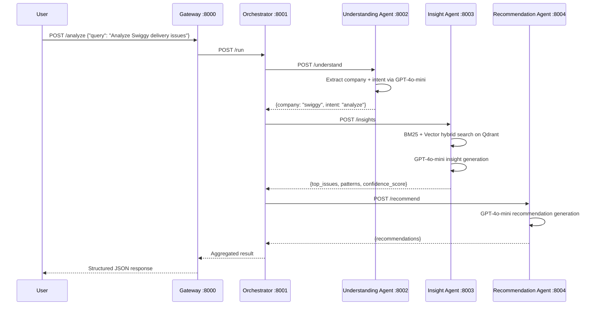
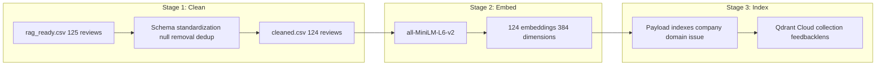
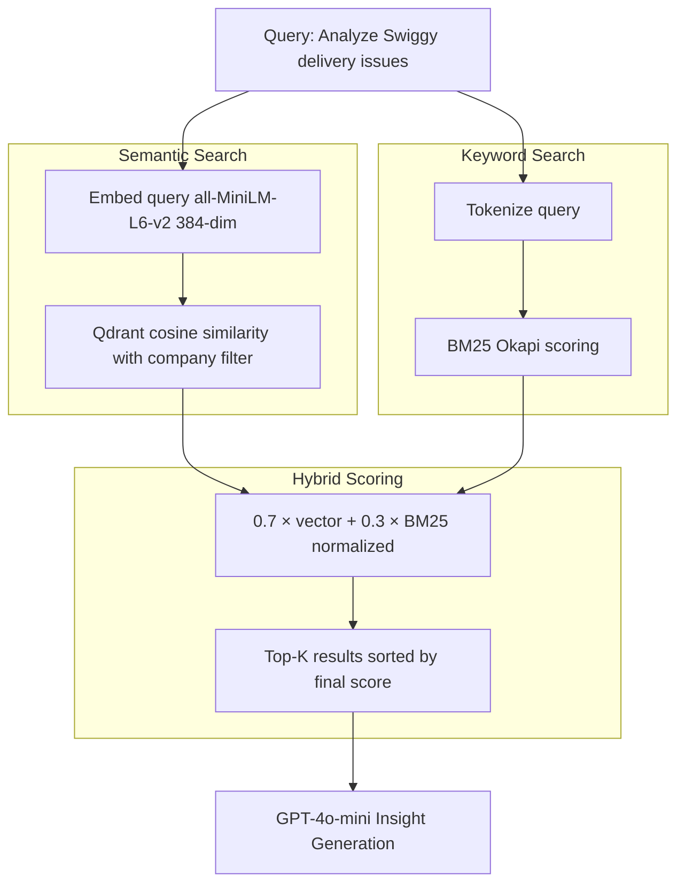
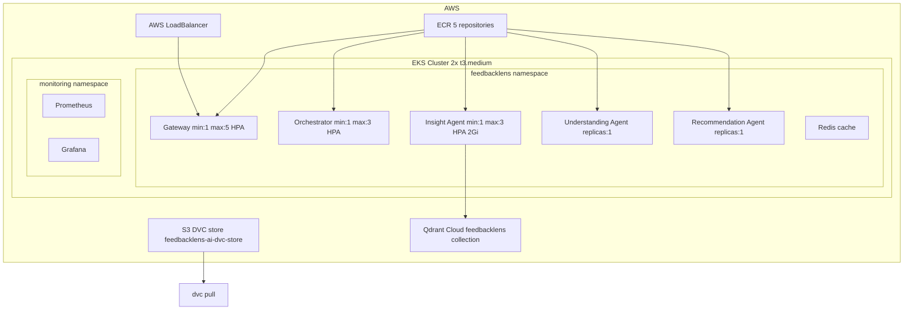

# 🔍 FeedbackLens AI

### Production-Grade Multi-Agent Feedback Intelligence Platform


---

## 📖 Overview

**FeedbackLens AI** is a **production-grade, multi-agent RAG system** that converts raw customer feedback into structured business insights and actionable recommendations.

Companies upload customer reviews → FeedbackLens processes them through a **3-agent pipeline** — extracting company intent, retrieving relevant context via hybrid search, and generating specific recommendations — all deployed on **AWS EKS** with automated CI/CD.

---

## ❌ Problem

- Companies receive thousands of unstructured customer reviews but lack tools to extract structured insights at scale
- Manual analysis takes **days per dataset** and misses cross-review patterns
- Generic feedback tools don't provide **actionable, company-specific recommendations**
- No scalable pipeline from raw CSV → production insights

---

## ✅ Solution

| Problem | Solution |
|---|---|
| Unstructured feedback | 3-agent RAG pipeline extracts structured insights |
| Missing patterns | Hybrid BM25 + vector search across 124 indexed reviews |
| Generic recommendations | GPT-4o-mini with company-specific context |
| No scalability | AWS EKS with HPA autoscaling |
| Manual deployment | Dual CI/CD pipelines — ingest + deploy |

---

## 🏗️ High-Level Architecture



---

## 🔁 End-to-End Request Flow



---

## 🧠 RAG Pipeline — DVC 3-Stage



---

## 🔍 Hybrid Search Pipeline



---

## 📊 Production Results

### Live Test on AWS EKS — Swiggy Analysis

```
Input:
  query: "Analyze Swiggy delivery issues"

Output:
  company:          swiggy
  top_issues:       ["delivery delays", "high delivery charges",
                     "inconsistent delivery times"]
  patterns:         ["customers frustrated with delivery delays",
                     "positive feedback on offers overshadowed by complaints"]
  recommendations:  ["Introduce guaranteed delivery time with discount for late deliveries",
                     "Utilize predictive analytics to reduce peak hour delays by 20%",
                     "Implement real-time ETA updates every 3 minutes"]
  confidence_score: 0.90
  failure_rate:     0%
```

### Load Test — Locust on AWS EKS

```
Endpoint:      POST /analyze (EKS LoadBalancer)
Users:         5 concurrent
Total requests: 109
Failures:      0 (0.00%)
Throughput:    0.96 req/s
Health P95:    310ms
```

### RAG Quality — RAGAS Evaluation

```
Reviews indexed:     124 (Swiggy, Uber, Zomato)
Faithfulness:        0.8073   ✅
Answer Relevancy:    0.9635   ✅
Context Precision:   0.4133
Context Recall:      0.8000   ✅
Hybrid vs dense:     +BM25 keyword matching for exact terms
```

---

## ⚡ Infrastructure



---

## 🔄 CI/CD Pipelines

### Ingest Pipeline — triggers on data changes
```
Trigger:  push to ingestion-pipeline/** or data/rag_ready.csv.dvc
Steps:    checkout → install deps → configure AWS → DVC pull
          → dvc repro --force → dvc push to S3
```

### Deploy Pipeline — triggers on code changes
```
Trigger:  push to services/** or shared/**
Steps:    detect changed services → build Docker image
          → push to ECR with SHA tag → ready for kubectl rollout
```

---

## 🧰 Tech Stack

| Category | Technology |
|---|---|
| Agent Orchestration | LangGraph StateGraph conditional routing |
| Embeddings | sentence-transformers/all-MiniLM-L6-v2 384-dim |
| Vector DB | Qdrant Cloud with payload indexes |
| Keyword Search | BM25 Okapi rank-bm25 |
| LLM | GPT-4o-mini (understanding + insight + recommendation) |
| Caching | Redis TTL-based query caching |
| RAG Quality | RAGAS (faithfulness, relevancy, recall) |
| Data Pipeline | DVC 3-stage with S3 remote |
| Load Testing | Locust |
| Serving | FastAPI async microservices |
| Infrastructure | AWS EKS + ECR + S3 + LoadBalancer |
| Autoscaling | HPA (gateway 1-5, orchestrator 1-3, insight 1-3) |
| Monitoring | Prometheus + Grafana (kube-prometheus-stack) |
| CI/CD | GitHub Actions (dual pipeline — ingest + deploy) |

---

## 🚀 Local Setup

```bash
git clone https://github.com/akashagalave/FEEDBACKLENS-AI
cd FEEDBACKLENS-AI

# Setup environment
python -m venv venv
source venv/bin/activate  # Windows: venv\Scripts\activate
pip install -r requirements.txt

# Configure environment
cp .env.example .env
# Add: OPENAI_API_KEY, QDRANT_HOST, QDRANT_API_KEY

# Pull data from DVC
dvc pull

# Start all services
docker-compose up --build

# Run ingestion pipeline
dvc repro

# Health check
curl http://localhost:8000/health

# Test query
curl -X POST http://localhost:8000/analyze \
  -H "Content-Type: application/json" \
  -d '{"query": "Analyze Swiggy delivery issues"}'

# Load test
locust -f locustfile.py --headless -u 5 -r 1 --run-time 2m \
  --html reports/locust_report.html
```

---

## 🔑 System Modes

### Mode 1 — Query-Based Analysis (API)
```json
Input:  {"query": "Analyze Swiggy delivery issues"}
Output: {"company": "swiggy", "top_issues": [...],
         "patterns": [...], "recommendations": [...],
         "confidence_score": 0.90}
```

### Mode 2 — Batch Analysis (Company Upload)
```json
Input:  {"company": "swiggy", "reviews": ["review1", "review2", ...]}
Output: {"summary": {"total_reviews_analyzed": 1000,
         "top_issues": [...]}, "recommendations": [...]}
```

---

## 👨‍💻 Author

**Akash Agalave**
- GitHub: [@akashagalave](https://github.com/akashagalave)